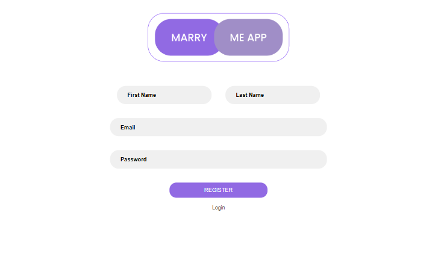
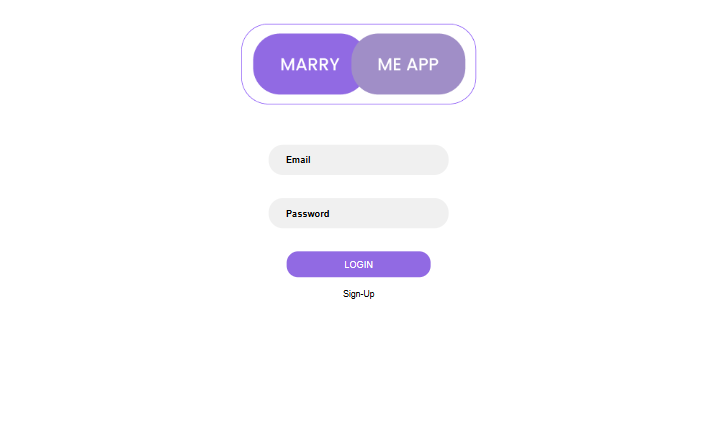
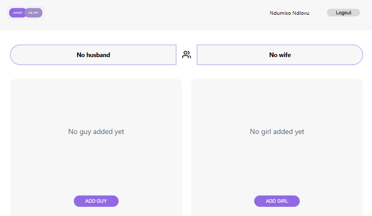
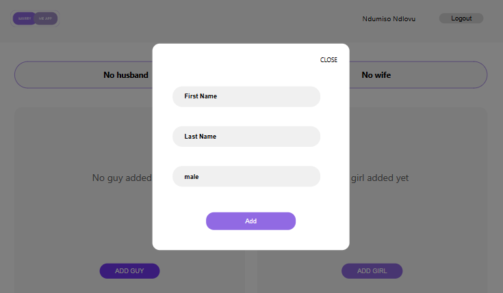
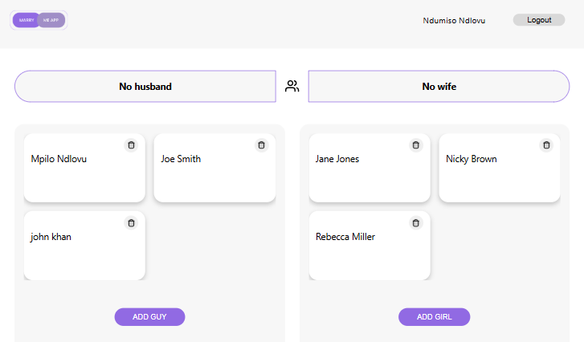
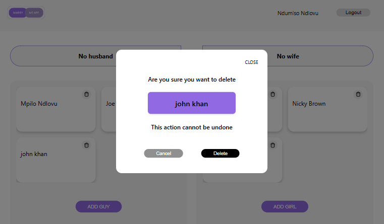
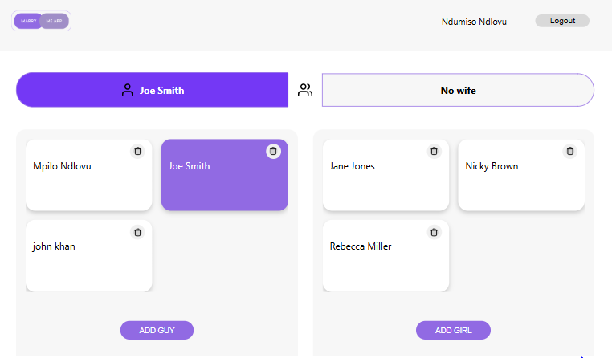
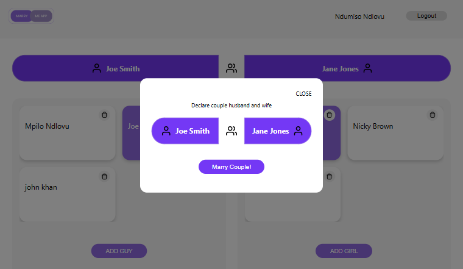
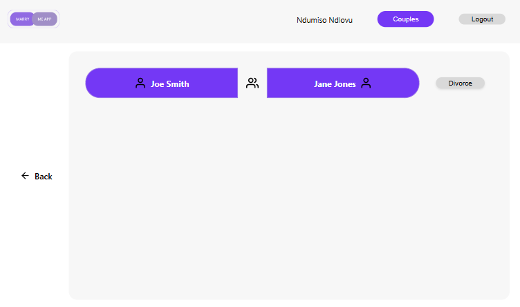
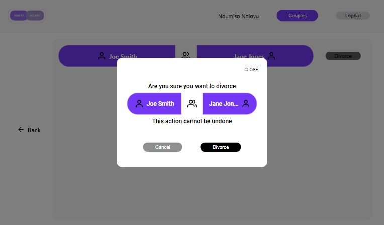

# Marry-Me Front-End

This is the front-end of the **Marry-Me** application, built using React, Redux Toolkit for state management, and Formik + Yup for form handling and validation.

🚧 This project is a work in progress and will continue to evolve as I actively grow and apply new skills throughout my development journey.

## Description

The Marry-Me app is a playful yet functional platform designed to simulate marriage and relationship dynamics in a virtual environment.

## 🌐 Live URL

> https://marry-me.online/

## 🛠 Tech Stack

- React
- Redux Toolkit
- Formik
- Yup
- Axios (for API requests)
- Styled Components

## 📦 Getting Started

### 1. Clone the Repository

```bash
git clone https://github.com/Mpilo-dev/marry-me-app.git
cd marry-me-frontend
```

### 2. Install Dependencies

```bash
npm install
```

###3. Start the Development Server

```bash 
npm start

This will run the app locally at http://localhost:8000.
```

## 🚀 Features

- ✅ User registration and authentication
- 👤 Create Person profiles
- 💑 Create and view Marriages
- 💔 File Divorces
- 🧠 Form validation with Formik and Yup
- 🌍 Global state management via Redux Toolkit

## 📷 Screenshots












## ✨ Future Enhancements

- Face lift of the SignUp/login page
- And many other enhancements
